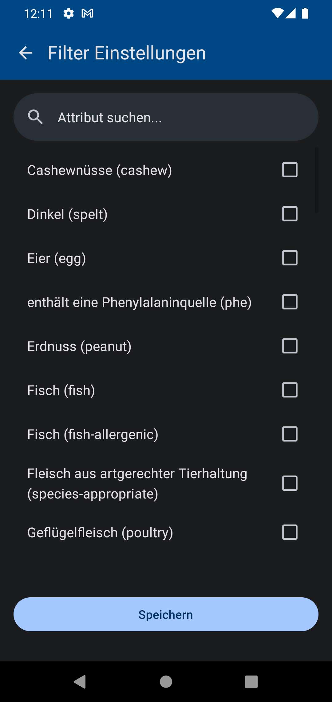

Eine Expo App für den Abruf der Mensa-Daten der Uni Oldenburg über StudIP(https://elearning.uni-oldenburg.de/).

## Technisch
- Die Anmeldung erfolgt über HTTP Basic Authentication. Die Login Daten werden verschlüsselt mittels Expo-SecureStore gespeichert.
- Theming ist mit [react-native-paper](https://callstack.github.io/react-native-paper/) realisiert

## Features
- Abruf der Mensa Daten zur Anzeige der Mensen (Uhlhornsweg, Wechloy) als Liste
- Einfache Navigation der Tage
- Filterung von Attributen der Speisen
- Liste von anstehenden Terminen.
- Abmeldung und Löschung des Login Tokens

## Todo
- Mal gucken... :)

